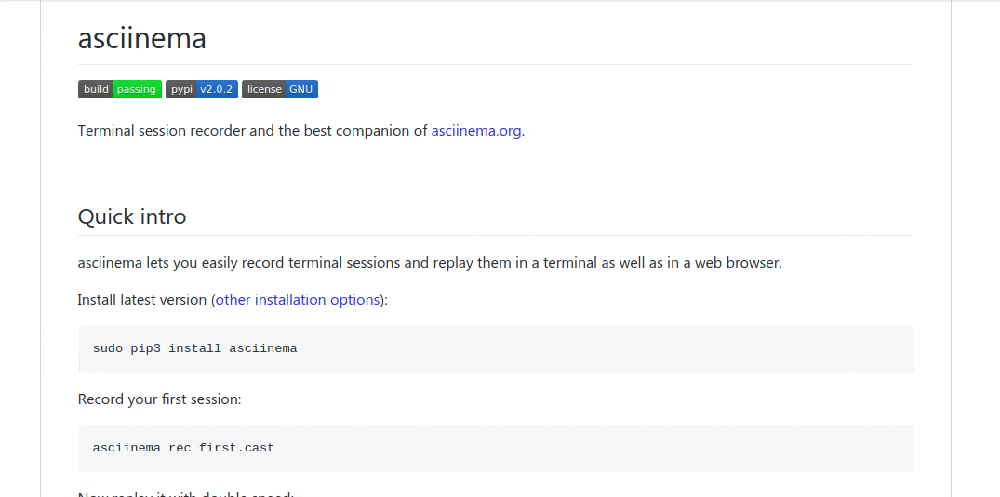

#  asciinema Player for GitHub

[link-cws]: https://chrome.google.com/webstore/detail/mkllmpcfhjcbkmegdpnaemhpdddffhil "Version published on Chrome Web Store"
[link-amo]: https://addons.mozilla.org/en-US/firefox/addon/asciinema-player-for-github/ "Version published on Mozilla Add-ons"

[](LICENSE) 
[][link-cws]
[][link-amo]


> Automatically detect instances of [asciinema](https://asciinema.org) links in a README on GitHub and embed the player in its place.

This is a lightweight Chrome extension. Instead of being directed to the asciinema website to watch the "asciicast", watch it directly in the README (or any `.md`, `.rst`, `.textile`, [etc.](https://github.com/github/markup/blob/master/README.md#markups) file), thanks to the [embedded player widget](https://asciinema.org/docs/embedding). 🎉



## Install

- [**Chrome** extension][link-cws] [][link-cws]
- [**Firefox** add-on][link-amo] [][link-amo]
- **Opera** extension: Use [this Opera extension](https://addons.opera.com/en/extensions/details/download-chrome-extension-9/) to install the Chrome version.

## Development

1. Clone this repository by running
    ```
    git clone https://github.com/plibither8/asciinema-player-for-github.git
    ```
1. Ensure you are running an up-to-date version of [Node.js](https://nodejs.org/en/download/package-manager/) on your machine, and that you have npm installed.
1. Open a terminal in the `asciinema-player-for-github` directory. Type
    ```
    npm install
    ```
    into the terminal to install the dependencies. To build the extension, type
    ```
    npm run watch
    ```
1. The extension files including the `manifest.json` file are in the `dist/` directory.

### Content Security Policy Modification

**Just FYI:** to allow third-party `iframe`s (in this case, from `asciinema.org`) to be rendered on github.com, the Content-Security-Policy (CSP) in the response headers of github.com are modified by this extension. The following modification takes place:

> Before: `frame-src render.githubusercontent.com;`
>
> After: `frame-src asciinema.org render.githubusercontent.com;`

For more details: [Content Security Policy (CSP) - Google Chrome](https://developer.chrome.com/extensions/contentSecurityPolicy)

Code: [background.js](src/background.js)

## Donate

asciinema Player for GitHub was made by me during my study-breaks and free time. If you like and have enjoyed it, please consider donating a small amount (any amount will be really appreciated!) to support and sustain its development. Thank you!

[](https://paypal.me/plibither8)

[](https://www.buymeacoffee.com/plibither8)

---

## License

Copyright (c) Mihir Chaturvedi. All rights reserved.

Licensed under the [MIT](LICENSE) License.
